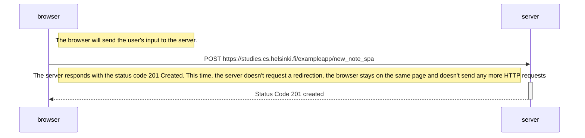

```mermaid
sequenceDiagram
    participant browser
    participant server

    Note right of browser: The browser will send the user's input to the server.

    browser->>server: POST https://studies.cs.helsinki.fi/exampleapp/new_note_spa

    Note right of browser: The server responds with the status code 201 Created. This time, the server doesn't request a redirection, the browser stays on the same page and doesn't send any more HTTP requests

    activate server
    server-->>browser: Status Code 201 created
    deactivate server
```
